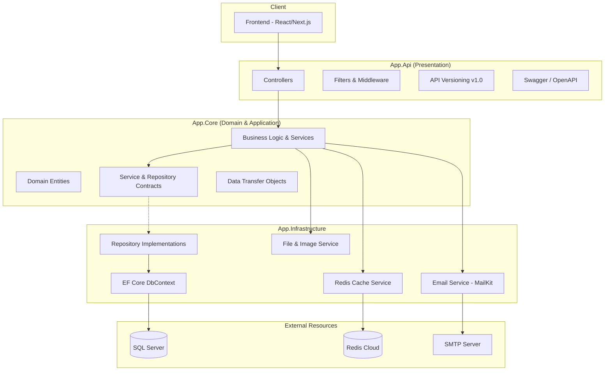

# Waffer (وافر) - Charity & Donor Connectivity Platform


**Waffer (وافر)** is a digital ecosystem designed to optimize the logistics of charitable giving and resource distribution. It addresses the critical challenge of resource fragmentation by providing a centralized, transparent marketplace where **Donor Organizations** with surplus resources can seamlessly connect with **Charities** in need.

The platform goes beyond simple listings by implementing a structured **application-to-fulfillment workflow**. Charities can post granular resource requirements (Needs), while donor organizations can publish available resources (Offers). Waffer facilitates a secure matchmaking process, allowing both parties to apply for resources, manage approvals, and track the status of every contribution in real-time. This ensures that donations are allocated efficiently, transparently, and where they can create the most significant social impact.

---

## Architecture Diagram

Waffer follows Clean Architecture principles, ensuring a clear separation of concerns, high testability, and independence from external frameworks.



---

## Features

- **Secure Identity Management**: Full authentication suite using ASP.NET Core Identity and JWT Bearer tokens with Refresh Token support.
- **Multi-Role System**: Specialized endpoints and workflows for Charities, Donor Organizations, and Administrators.
- **Resource Tracking**: 
  - **Charity Needs**: Charities can post and manage their specific resource requirements.
  - **Donation Offers**: Donor organizations can list available resources.
- **Application Workflow**: A robust system for applying to needs/offers, complete with status tracking (Pending, Accepted, Rejected, Fulfilled).
- **Redis Caching**: Optimized public browsing using distributed caching to ensure high response times.
- **Automated Notifications**: Integrated email system for account verification and status updates using MailKit.
- **Media Handling**: Secure image upload and management system with built-in validation for size and file types.
- **Statistics & Analytics**: Comprehensive dashboards for tracking platform-wide donation activity.
- **Advanced Security**: Implements CORS policies, secure password hashing, and custom validation filters.

---

## Technologies & Techniques

- **Framework**: ASP.NET Core 10.0 (Web API)
- **Database**: SQL Server with Entity Framework Core (Code-First)
- **Caching**: Redis (StackExchange.Redis) for distributed state and performance.
- **Security**: 
  - JWT (JSON Web Tokens) for stateless authentication.
  - ASP.NET Core Identity for user management.
- **Logging**: Serilog with rolling file sinks for production-grade observability.
- **Documentation**: Swagger/OpenAPI 3.0 with XML documentation for clear developer integration.
- **Patterns**: Repository Pattern, Unit of Work, Result Pattern, Dependency Injection.
- **Mapping**: Manual mapping for full control over DTO/Entity transitions.

---

## Setup Instructions

### Prerequisites
- [.NET 10 SDK](https://dotnet.microsoft.com/download)
- [SQL Server](https://www.microsoft.com/en-us/sql-server/sql-server-downloads)
- [Redis](https://redis.io/download) (or a Redis Cloud account)

### Steps
1. **Clone the Repository**
   ```bash
   git clone https://github.com/Youssef-M-Salama/app-api.git
   cd app-api
   ```

2. **Configure Environment**
   Update `App.Api/appsettings.json` with your credentials:
   - **ConnectionStrings**: Set `DefaultConnection` to your SQL Server instance.
   - **Redis**: Enter your host, port, and password.
   - **Email**: Configure SMTP settings (Host, Port, SenderEmail, Password).
   - **Jwt**: Set a secure `Key`, `Issuer`, and `Audience`.

3. **Database Initialization**
   The application automatically seeds roles and initial data on startup. To apply migrations:
   ```bash
   dotnet ef database update --project App.Infrastructure --startup-project App.Api
   ```

4. **Run the Application**
   ```bash
   dotnet run --project App.Api
   ```

---

## Environment Variables (appsettings.json)

| Section | Key | Description |
| :--- | :--- | :--- |
| `ConnectionStrings` | `DefaultConnection` | SQL Server connection string |
| `Redis` | `Host`, `Port`, `Password` | Redis server details |
| `Jwt` | `Key`, `Issuer`, `Audience` | JWT security configuration |
| `Email` | `Host`, `Port`, `SenderEmail` | SMTP server configuration |
| `AppSettings` | `BaseUrl` | Public URL for link generation |

---

## Folder Structure

```text
app-api/
├── App.Api/              # Presentation Layer (Controllers, Filters, Startup)
├── App.Core/             # Domain & Application Layer (Entities, DTOs, Services)
├── App.Infrastructure/    # Data & External Services (DbContext, Repos, Caching)
├── App.Api.Tests/        # Integration & Unit Tests for API
├── App.Services.Tests/   # Unit Tests for Business Logic
└── docs/                 # Project Documentation (API Ref, Contracts, etc.)
```

---

## Documentation

For detailed information on specific areas of the platform, please refer to the internal documentation:

- [API Reference](./docs/api-reference.md): Full list of endpoints, methods, and access levels.
- [API Response Contracts](./docs/api-response-contracts.md): Detailed success/error response patterns and enum definitions.
- [Email Notifications](./docs/email-notifications.md): Breakdown of all system-triggered emails and their Arabic subjects.
- [User Stories](./docs/user-stories.md): Business requirements and acceptance criteria for all user roles.

---

## Links

- **Swagger Documentation**: [https://waffer.runasp.net/swagger/index.html](https://waffer.runasp.net/swagger/index.html)
- **Frontend Repository**: [Youssef-M-Salama/app-client](https://github.com/Youssef-M-Salama/app-client)
- **Backend Repository**: [Youssef-M-Salama/app-api](https://github.com/Youssef-M-Salama/app-api)

